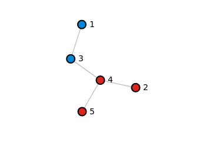
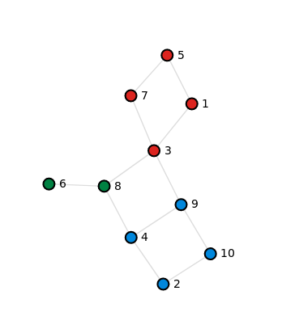

# Random topology builder
Random network topology builder for k8s-topo

## Usage

```bash
usage: builder [-h] [--prefix PREFIX] num extra

Example full-mesh OSPF topology builder for k8s-topo

positional arguments:
  num              Number of nodes
  extra            Number of extra links (in addition to the min NUM-1 number
                   of links)

optional arguments:
  -h, --help       show this help message and exit
  --prefix PREFIX  Device hostname prefix
```

## Visualisation

The script generates a D3-compliant JSON that is rendered by d3.js in index.html. To view the result do:

```
firefox index.html
```


## Examples

### 5-node topology 

This will generate a uniform spanning tree using a random walk algorithm. The number of links will be N-1 

```
./builder 5 0
```

This may result in the following topology:

```
firefox index.html
```



### 10-node topology with 3 extra links

This will add 3 extra links between random pair of nodes in addition to a uniform spanning tree. The number of links will be (N - 1 + extra)

```
./builder 10 3
```

This may result in the following topology



